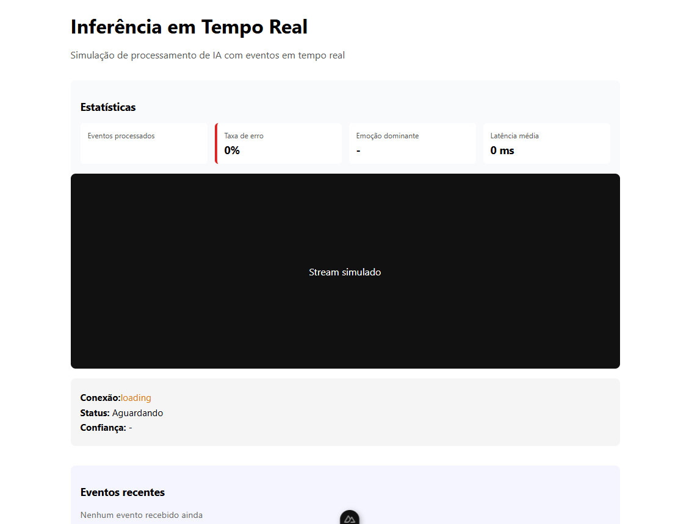

# Frontend - Teste Técnico Full Stack (eMiolo.com)

Este diretório contém a interface do usuário desenvolvida com Nuxt 3 para o teste técnico da eMiolo.com. A aplicação foca na visualização de dados de inteligência artificial em tempo real, integrando análise emocional e monitoramento de risco.

---

## Stack Tecnológica

- **Framework:** Nuxt 3 (Vue.js)
- **Linguagem:** TypeScript
- **Comunicação Real-time:** WebSockets (Socket.io) para o stream de inferências.

---

## Funcionalidades Implementadas

- **Monitor de Inferência (Player Simulado):** Renderização de bounding boxes e badges de risco sobre um placeholder de vídeo, atualizados dinamicamente via socket.

- **Gestão de Conexão:** Indicadores de estado (Conectado, Carregando, Erro) integrados ao ciclo de vida do Socket.io.

- **Feed de Eventos Recentes:** Listagem reativa que organiza as últimas detecções por nível de risco e confiança.

- **Dashboard de Métricas:** Visualização de dados de observabilidade, como total de eventos processados e latência média.

---

## Estrutura de Arquivos

- **app/pages/index.vue**: Layout principal que organiza os módulos de estatísticas, player e lista de eventos.

- **app/components/PlayerFake.vue**: Lógica de conexão WebSocket e cálculo de posicionamento das caixas de detecção (bbox).

- **app/components/ListaEventos.vue**: Gerenciamento do histórico de eventos recebidos em tempo real.

- **app/components/DashboardStats.vue**: Interface para exibição dos dados de saúde e performance do sistema.

---

## Como executar o projeto

```

Clone o repositório:
git clone https://github.com/RoberthVieira/emioloTeste.git

Instale as dependências:
npm install

Execute o servidor de desenvolvimento:
npx nuxi dev --port 3001

Acesse em:
http://localhost:3001

```
---

### Diferenciais Técnicos Aplicados

- Uso de requestId único gerado no frontend para rastrear as sessões de inferência.
- **Limitação de Memória**: O feed de eventos é programado para manter apenas os últimos 10     itens, evitando sobrecarga do navegador durante transmissões longas.

---

## Preview
